<div align="center">

# TripBora

### 여행의 모든 순간을 보라

여행지를 발견하고, 함께 계획하고, 다녀온 순간을 나만의 여행일기로 남기는 여행 플랫폼

[](https://tripbora.com)
[](#tech-stack)
[](#tech-stack)
[](#tech-stack)
[](#system-architecture)

</div>

<br>

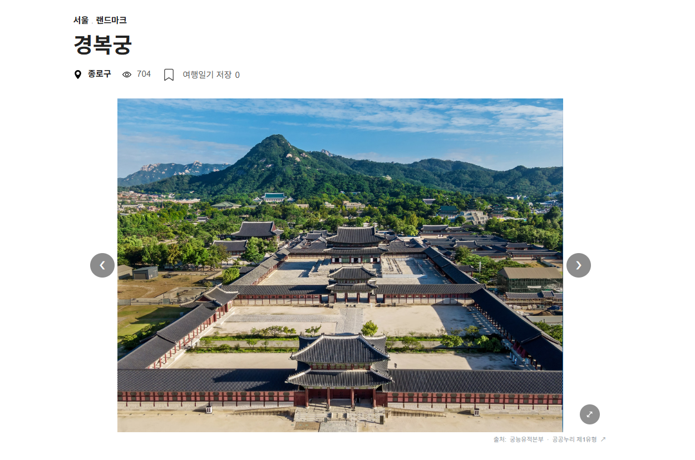

---

## Project Overview

**TripBora**는 여행지를 찾는 단계에서 끝나지 않고 **탐색 → 정보 확인 → 코스 구성 → 공동 계획 → 여행 기록 → 커뮤니티 소통**까지 하나의 흐름으로 연결한 여행 서비스입니다.

단순 CRUD 구현보다 실제 서비스 운영에 필요한 **인증·권한, 다국어, 실시간 협업, 콘텐츠 관리, 이미지 출처 관리, 사용자 데이터 보호, Docker 배포**까지 함께 설계했습니다.

### 핵심 경험

| 영역 | 제공 기능 |
| --- | --- |
| 🗺️ 여행 탐색 | 국내·해외 여행지, 여행정보, 축제·행사, 여행코스 |
| 📖 여행 기록 | 자유배치형 여행일기, 표지 꾸미기, 표지 라이브러리, PDF 저장 |
| 👥 공동 계획 | 멤버 초대, 일정 공동 편집, 채팅, 투표, 최종 계획 확정 |
| 🌐 다국어 | 서비스 다국어 UI, 여행 콘텐츠 번역, 게시글·댓글 번역 |
| 🛡️ 운영 | 회원 제재/이의신청, 신고·모더레이션, 개인정보 파기 흐름 |
| 🚀 배포 | Docker Compose 기반 Spring Boot + MySQL 운영 환경 |

---

## Key Features

### 01. 여행지 · 여행정보 · 축제

<table width="100%">
  <tr>
    <td width="33.33%" align="center" valign="top">
      <br>
      <sub>여행지</sub>
    </td>
    <td width="33.33%" align="center" valign="top">
      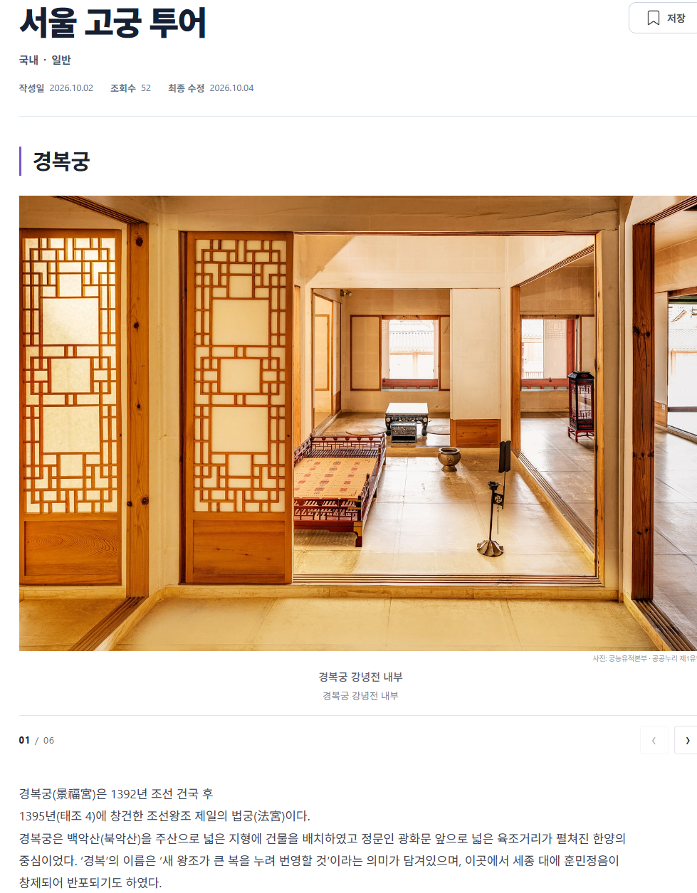<br>
      <sub>여행정보</sub>
    </td>
    <td width="33.33%" align="center" valign="top">
      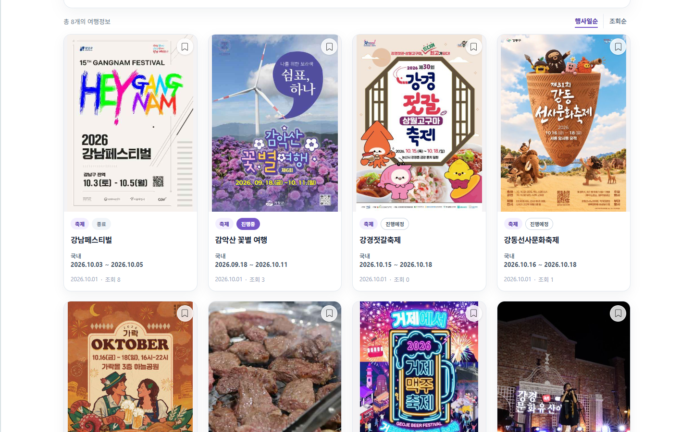<br>
      <sub>축제·행사</sub>
    </td>
  </tr>
</table>

- 여행지 유형별 상세정보 및 카테고리/편의시설 관리
- 여행정보 `QUILL / STRUCTURED` 이중 콘텐츠 포맷
- 국내·해외 일반정보, 여행가이드, 축제·행사 분리
- TourAPI 및 외부 콘텐츠 출처 식별자 기반 중복 방지
- 이미지별 출처·저작자·라이선스 메타데이터 관리
- 다국어 번역 데이터와 원문 구조 분리

### 02. 여행코스

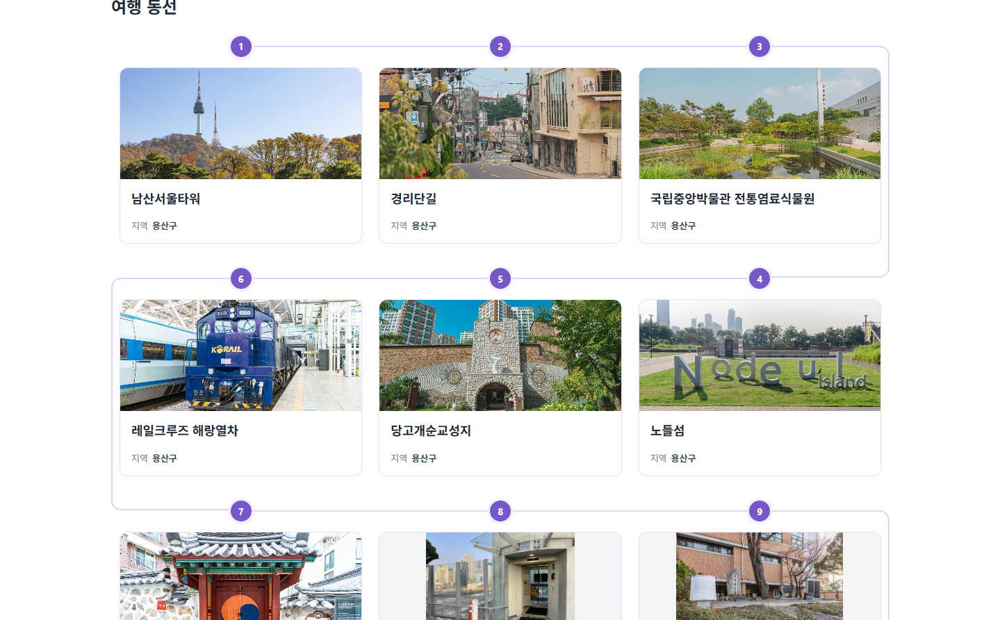

- 여러 여행지를 방문 순서대로 연결한 코스 구성
- 사용자 작성 콘텐츠, 댓글, 이미지, 좋아요
- 원문 언어 감지 및 번역 지원

### 03. 여행일기

<p align="center">
  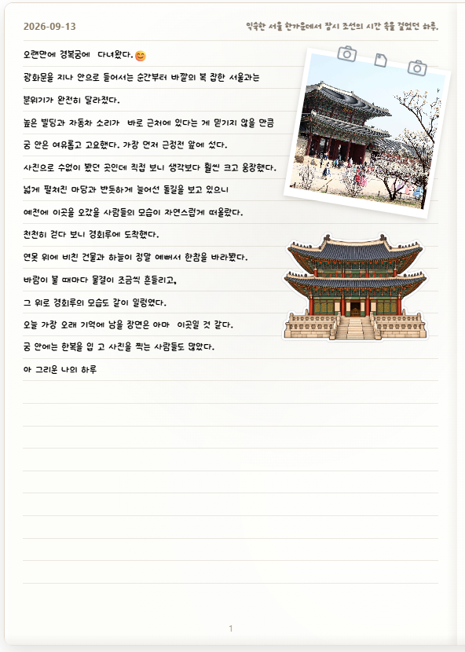
</p>

<table width="100%">
  <tr>
    <td width="50%" align="center" valign="top">
      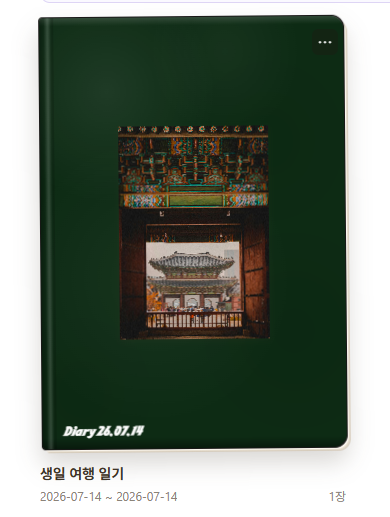<br>
      <sub>다이어리 표지</sub>
    </td>
    <td width="50%" align="center" valign="top">
      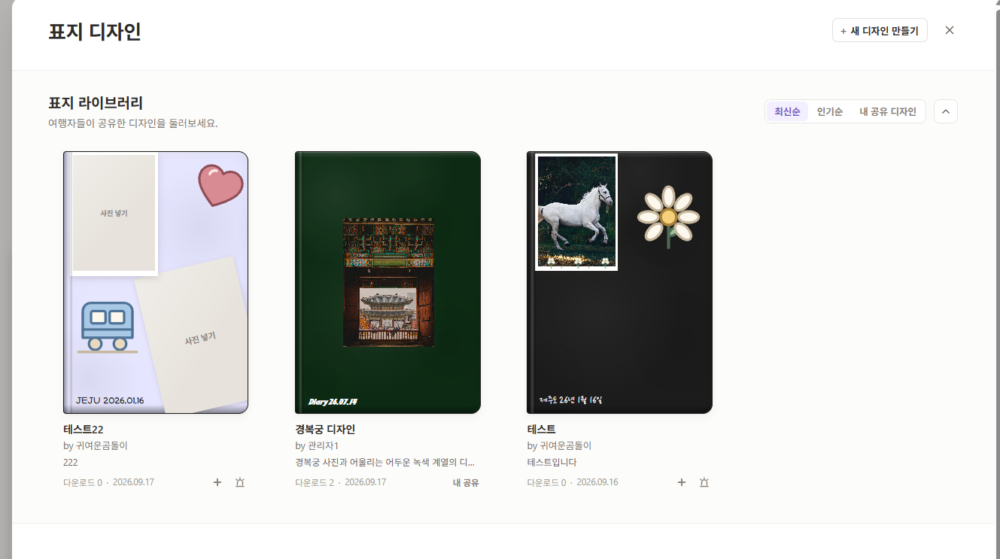<br>
      <sub>표지 라이브러리</sub>
    </td>
  </tr>
  <tr>
    <td width="50%" align="center" valign="top">
      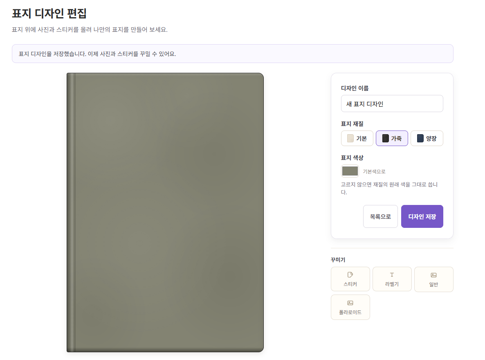<br>
      <sub>표지 꾸미기</sub>
    </td>
    <td width="50%" align="center" valign="top">
      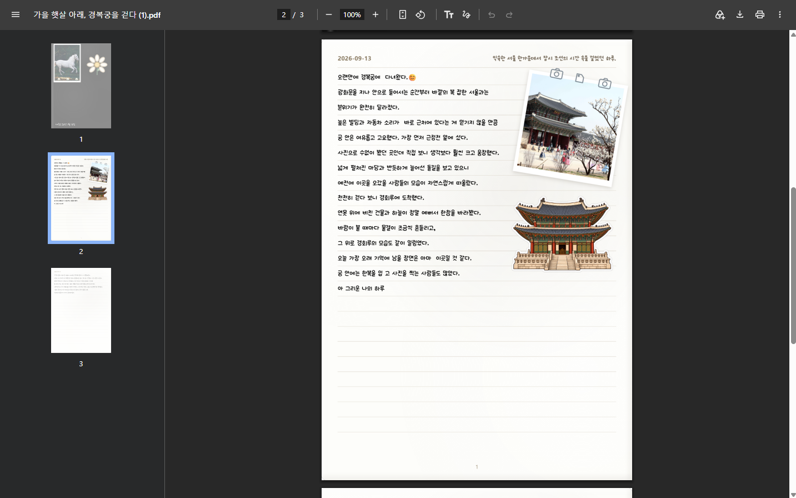<br>
      <sub>PDF 저장</sub>
    </td>
  </tr>
</table>

- TEXT / PHOTO / STICKER / NOTE 요소를 자유롭게 배치
- 상대좌표 기반 위치·크기·회전·z-index 저장
- 일반노트 / 스프링노트, 종이색·배경무늬·페이지별 헤더
- 커스텀 표지 디자인 저장 및 적용
- 사용자 표지 디자인 라이브러리 공유
- 사진 포함 여부와 권리 확인을 고려한 라이브러리 스냅샷 구조
- 브라우저 기반 PDF 저장

### 04. 함께 계획하기

<table width="100%">
  <tr>
    <td width="50%" align="center" valign="top">
      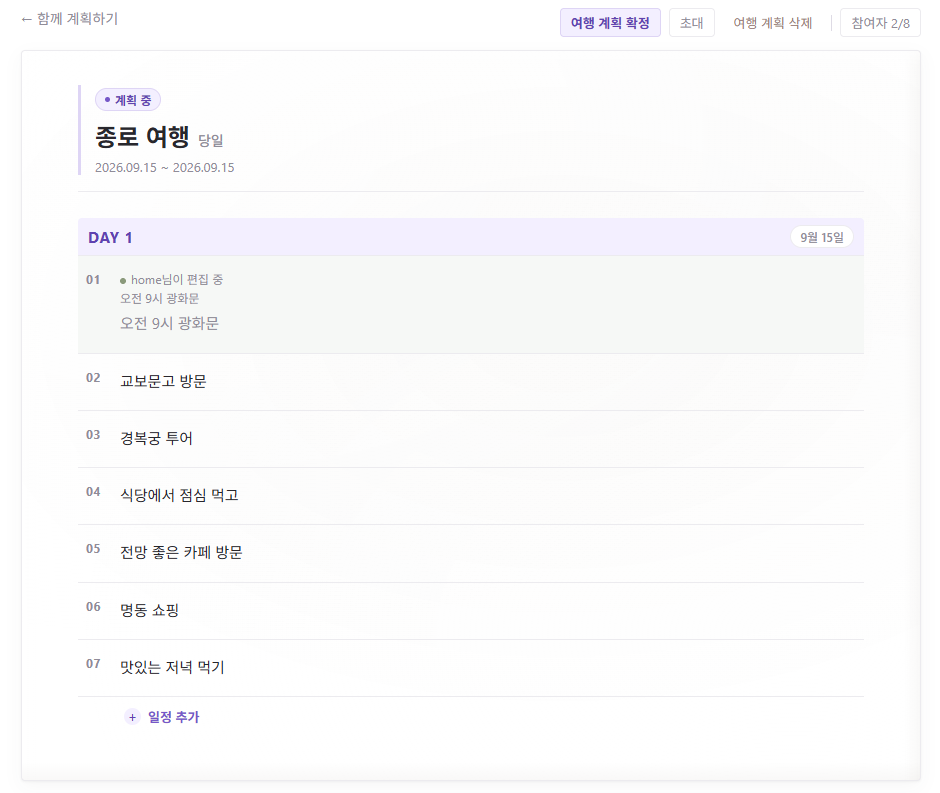<br>
      <sub>공동 여행계획</sub>
    </td>
    <td width="50%" align="center" valign="top">
      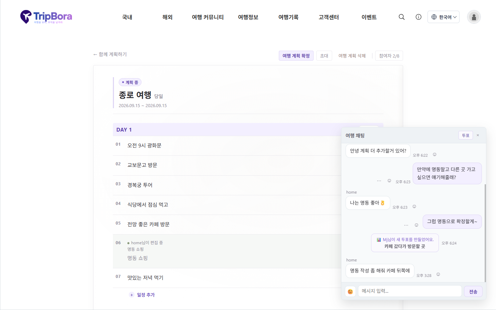<br>
      <sub>실시간 채팅</sub>
    </td>
  </tr>
  <tr>
    <td width="50%" align="center" valign="top">
      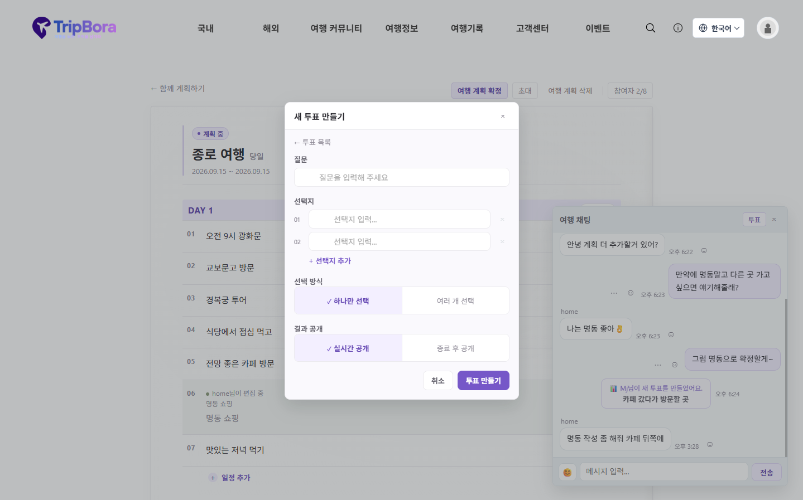<br>
      <sub>투표 생성</sub>
    </td>
    <td width="50%" align="center" valign="top">
      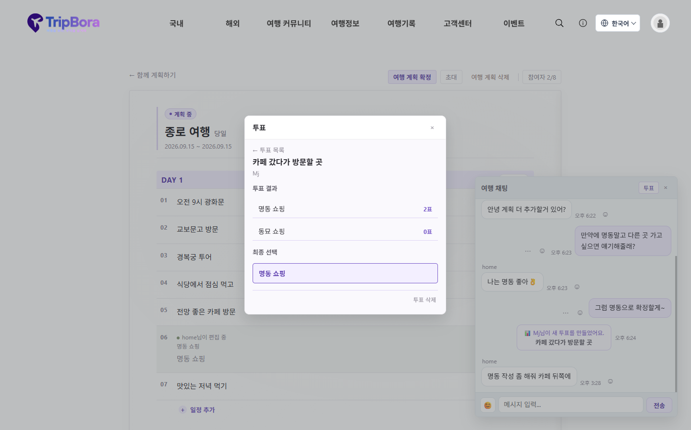<br>
      <sub>투표 결과</sub>
    </td>
  </tr>
</table>

- 여행계획별 멤버·권한·초대 관리
- 날짜별 일정과 대안 일정 구성
- WebSocket + STOMP 기반 실시간 협업
- 채팅, 읽음 위치, 메시지 반응
- 단일/복수 선택 투표와 마감 정책
- 계획 확정 시 **최종 Snapshot을 별도 보존**하여 이후 변경과 분리

### 05. 번역으로 소통하기

<table width="100%">
  <tr>
    <td width="50%" align="center" valign="top">
      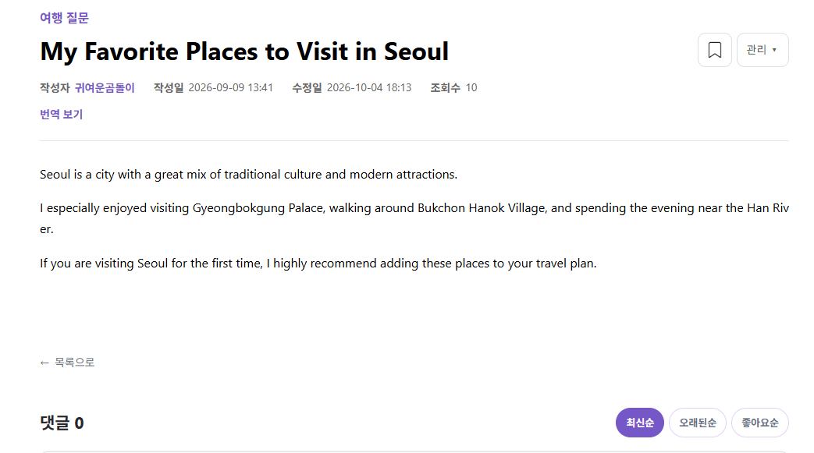<br>
      <sub>커뮤니티 원문</sub>
    </td>
    <td width="50%" align="center" valign="top">
      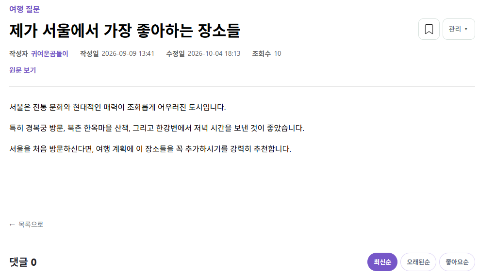<br>
      <sub>커뮤니티 번역</sub>
    </td>
  </tr>
  <tr>
    <td width="50%" align="center" valign="top">
      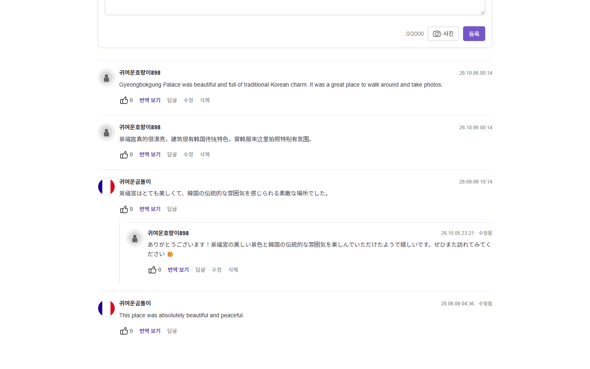<br>
      <sub>댓글 원문</sub>
    </td>
    <td width="50%" align="center" valign="top">
      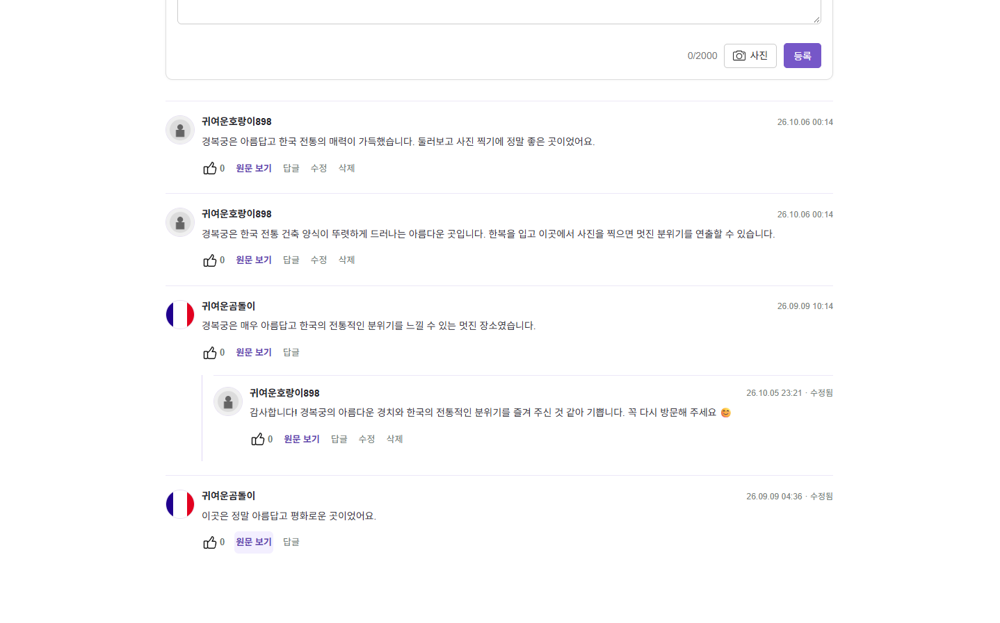<br>
      <sub>댓글 번역</sub>
    </td>
  </tr>
</table>

- 사용자 콘텐츠의 원문 언어 감지
- Google Cloud Translation 연동
- 콘텐츠 단위 캐시 + 동일 원문 공유 캐시
- `source_hash + source_language + target_language + profile` 기준 번역 재사용
- `PROCESSING / READY / FAILED`, lease / retry 구조로 중복 번역 호출 제어

---

<a id="tech-stack"></a>
## Tech Stack

### Backend

<p>
  
  
  
  
  
  
</p>

### Frontend

<p>
  
  
  
  
</p>

### Data · Infra · External

<p>
  
  
  
  
  
</p>

**주요 라이브러리 / 연동**

`Spring MVC` · `Spring Security` · `OAuth2 Client` · `MyBatis` · `Thymeleaf` · `PageHelper` · `WebSocket/STOMP` · `jsoup` · `Lingua` · `Google Cloud Translation` · `html-to-image` · `jsPDF`

---

<a id="system-architecture"></a>
## System Architecture

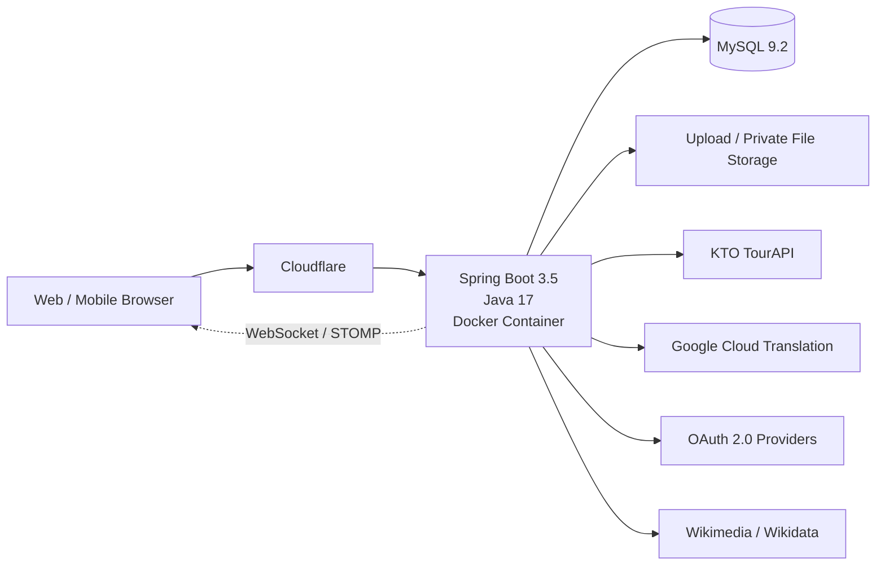
```mermaid
flowchart LR
    USER["Web / Mobile Browser"]
    CF["Cloudflare"]
    APP["Spring Boot 3.5<br/>Java 17<br/>Docker Container"]
    DB[("MySQL 9.2")]
    FILE["Upload / Private File Storage"]

    KTO["KTO TourAPI"]
    TRANS["Google Cloud Translation"]
    OAUTH["OAuth 2.0 Providers"]
    WIKI["Wikimedia / Wikidata"]

    USER --> CF --> APP
    APP --> DB
    APP --> FILE
    APP --> KTO
    APP --> TRANS
    APP --> OAUTH
    APP --> WIKI
    APP -. "WebSocket / STOMP" .-> USER
```

### Application Layer

```text
Controller
    ↓
Service
    ↓
Mapper Interface
    ↓
Mapper XML
    ↓
MySQL
```

JPA 대신 **MyBatis XML Mapper**를 사용해 SQL과 조회 정책을 명시적으로 관리합니다.

---

## Engineering Highlights

### 1. 구조화 여행정보와 다국어 텍스트를 분리

일반 HTML 편집기만으로는 이미지·슬라이더·그리드와 다국어 텍스트를 안정적으로 관리하기 어려웠습니다.

- `QUILL / STRUCTURED` 두 가지 본문 포맷 지원
- STRUCTURED 원본은 JSON block 구조로 보존
- 번역 테이블에는 블록 전체를 복제하지 않고 `structured_text` override만 저장
- 이미지와 레이아웃은 공통으로 유지하고 언어별 텍스트만 교체

이를 통해 **콘텐츠 구조와 번역 데이터를 분리**하고 언어별 중복을 줄였습니다.

### 2. 번역 API 호출을 줄이기 위한 2단계 Cache

사용자 게시글/댓글은 같은 문장이 여러 위치에서 반복될 수 있고, 번역 API를 매번 호출하면 비용과 응답시간이 증가합니다.

- 콘텐츠별 `content_translation_cache`
- 동일 원문 재사용을 위한 `shared_translation_cache`
- 원문의 SHA-256 hash를 기준으로 정확한 번역 결과 재사용
- 처리 상태와 lease 만료시간을 저장해 동시 요청의 중복 provider 호출 제어
- 실패 결과의 retry 시점을 별도로 관리

### 3. 자유배치형 여행일기의 좌표 모델

다이어리 꾸미기 요소를 고정된 픽셀 좌표로 저장하면 화면 크기 변화에 취약합니다.

- 좌표와 크기를 페이지 기준 상대값으로 저장
- `position_x / position_y / width / height / rotation / z_index`
- PHOTO / STICKER / NOTE / TEXT별 payload 제약
- 표지 편집기와 페이지 편집기에서 동일한 자유배치 개념 사용

### 4. 공동 여행계획의 작업 데이터와 확정 데이터 분리

공동 계획은 여러 사용자가 계속 수정하므로, 최종 확정 이후에도 작업 테이블만 사용하면 과거 결과가 변할 수 있습니다.

- 일정 / 대안 / 투표 / 채팅을 작업 모델로 구성
- 확정 시 `travel_plan_final_*` 테이블에 Snapshot 생성
- 최종본을 실시간 편집 데이터와 분리하여 보존

### 5. 사용자 상태와 운영 정책을 데이터 모델에 반영

서비스 운영에서 회원은 단순 ACTIVE/INACTIVE만으로 끝나지 않습니다.

- 이메일 인증 전 / 정상 / 휴면 / 제재 / 탈퇴 유예 / 탈퇴 완료 상태 분리
- 임시·영구 제재 및 이의신청
- 탈퇴 유예 후 파기 작업
- 재가입 차단용 이메일 원문 대신 hash 보관
- 콘텐츠 신고와 관리자 moderation 이력 관리

---

## Database / ERD

개발 DB 기준 전체 스키마는 **116개 테이블**로 구성되어 있습니다.  
메인 README에서는 전체 테이블을 나열하기보다 **서비스 핵심 도메인의 관계가 한눈에 보이도록 요약 ERD**만 보여줍니다.

### Travel Content

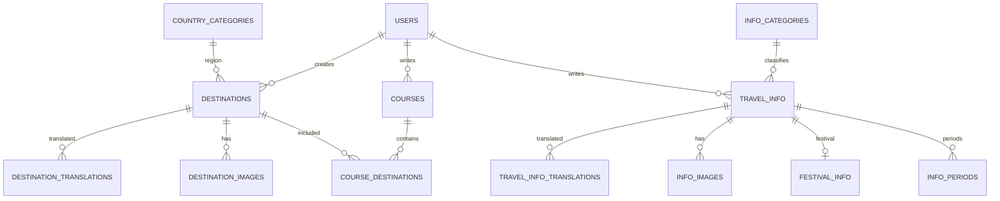
```mermaid
erDiagram
    direction TB

    USERS ||--o{ DESTINATIONS : creates
    COUNTRY_CATEGORIES ||--o{ DESTINATIONS : region
    DESTINATIONS ||--o{ DESTINATION_TRANSLATIONS : translated
    DESTINATIONS ||--o{ DESTINATION_IMAGES : has

    USERS ||--o{ COURSES : writes
    COURSES ||--o{ COURSE_DESTINATIONS : contains
    DESTINATIONS ||--o{ COURSE_DESTINATIONS : included

    USERS ||--o{ TRAVEL_INFO : writes
    INFO_CATEGORIES ||--o{ TRAVEL_INFO : classifies
    TRAVEL_INFO ||--o{ TRAVEL_INFO_TRANSLATIONS : translated
    TRAVEL_INFO ||--o{ INFO_IMAGES : has
    TRAVEL_INFO ||--o| FESTIVAL_INFO : festival
    TRAVEL_INFO ||--o{ INFO_PERIODS : periods
```

- `destinations`를 중심으로 번역·이미지·코스가 연결됩니다.
- `travel_info`는 일반 여행정보·가이드·축제를 하나의 공통 콘텐츠 모델로 관리합니다.
- 번역 데이터와 공통 구조를 분리해 다국어 콘텐츠의 중복을 줄였습니다.

### Travel Diary

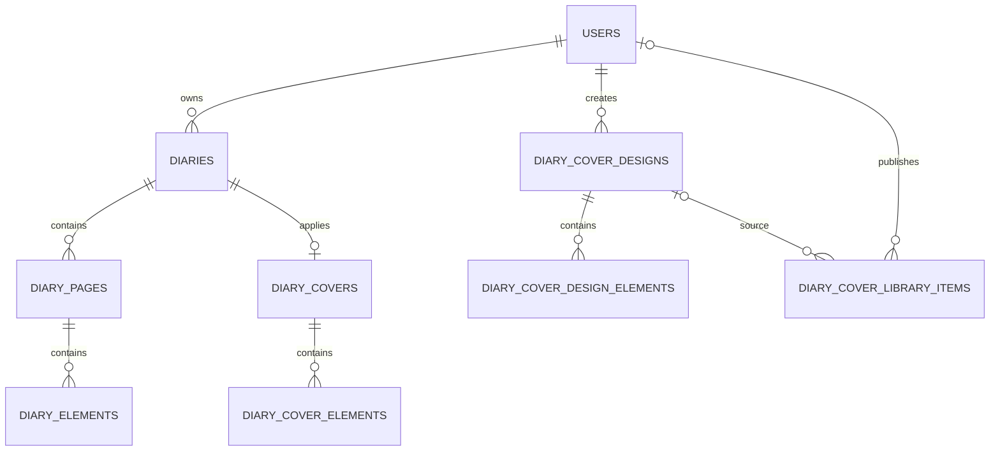
```mermaid
erDiagram
    direction TB

    USERS ||--o{ DIARIES : owns
    DIARIES ||--o{ DIARY_PAGES : contains
    DIARY_PAGES ||--o{ DIARY_ELEMENTS : contains

    USERS ||--o{ DIARY_COVER_DESIGNS : creates
    DIARY_COVER_DESIGNS ||--o{ DIARY_COVER_DESIGN_ELEMENTS : contains

    DIARIES ||--o| DIARY_COVERS : applies
    DIARY_COVERS ||--o{ DIARY_COVER_ELEMENTS : contains

    USERS |o--o{ DIARY_COVER_LIBRARY_ITEMS : publishes
    DIARY_COVER_DESIGNS |o--o{ DIARY_COVER_LIBRARY_ITEMS : source
```

- `diaries → diary_pages → diary_elements`로 한 권의 일기와 자유배치 요소를 계층화했습니다.
- 페이지 요소와 표지 요소는 별도 테이블로 분리해 서로 독립적으로 편집할 수 있습니다.
- 표지 디자인 원본과 실제 다이어리에 적용된 표지는 복사본으로 분리해 기존 기록이 변하지 않게 했습니다.

### Collaborative Travel Plan

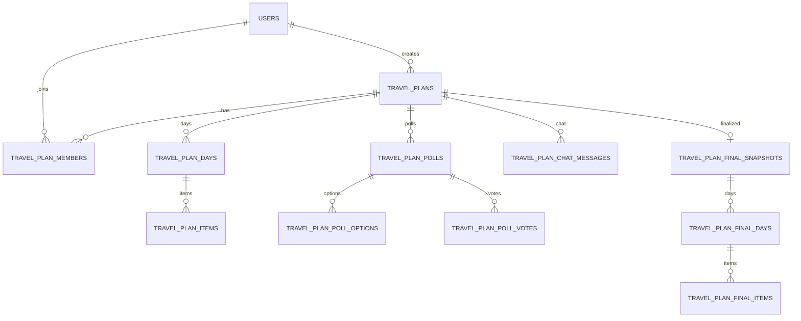
```mermaid
erDiagram
    direction TB

    USERS ||--o{ TRAVEL_PLANS : creates
    TRAVEL_PLANS ||--o{ TRAVEL_PLAN_MEMBERS : has
    USERS ||--o{ TRAVEL_PLAN_MEMBERS : joins

    TRAVEL_PLANS ||--o{ TRAVEL_PLAN_DAYS : days
    TRAVEL_PLAN_DAYS ||--o{ TRAVEL_PLAN_ITEMS : items

    TRAVEL_PLANS ||--o{ TRAVEL_PLAN_POLLS : polls
    TRAVEL_PLAN_POLLS ||--o{ TRAVEL_PLAN_POLL_OPTIONS : options
    TRAVEL_PLAN_POLLS ||--o{ TRAVEL_PLAN_POLL_VOTES : votes

    TRAVEL_PLANS ||--o{ TRAVEL_PLAN_CHAT_MESSAGES : chat

    TRAVEL_PLANS ||--o| TRAVEL_PLAN_FINAL_SNAPSHOTS : finalized
    TRAVEL_PLAN_FINAL_SNAPSHOTS ||--o{ TRAVEL_PLAN_FINAL_DAYS : days
    TRAVEL_PLAN_FINAL_DAYS ||--o{ TRAVEL_PLAN_FINAL_ITEMS : items
```

- 공동 일정, 채팅, 투표를 하나의 여행계획 도메인 안에서 관리합니다.
- 멤버와 날짜별 일정은 계획에 각각 연결해 참여자 관리와 일정 편집을 분리했습니다.
- 계획 확정 시 별도 Snapshot을 만들어 이후 수정과 최종 결과를 분리합니다.

---

## Security & Operations

- Spring Security 기반 세션 인증 / 권한 분리
- OAuth2 소셜 계정 연결
- ADMIN 영역 접근 제어
- 사용자 HTML `jsoup` 정화
- 이미지/업로드 파일과 private storage 분리
- 제재·이의신청·신고·복구·탈퇴/파기 흐름
- 환경변수를 통한 운영 비밀정보 외부 주입
- 운영 애플리케이션과 MySQL을 Docker Compose로 분리
- MySQL healthcheck 이후 애플리케이션 기동

---

## Testing

- JUnit 5 / Spring Boot Test
- Spring Security Test
- MyBatis Test
- Controller / Service / Repository 단위 및 통합 테스트
- HTML/CSS/JS contract test를 통한 주요 UI 회귀 검증
- 파일 저장·권한·경로 검증 테스트

기능 규모가 커진 뒤에도 변경 범위에 따라 **핵심 회귀 테스트 → 전체 테스트** 순으로 검증 범위를 조절하고 있습니다.

---

## Project Structure

```text
src/main
├── java/com/tripbora
│   ├── controller
│   ├── service
│   ├── mapper
│   ├── config
│   └── ...
│
├── resources
│   ├── mapper
│   ├── templates
│   ├── static
│   ├── json
│   └── messages*.properties
│
Dockerfile
compose.yaml
compose.prod.yaml
build.gradle
```

---

## Run

### Local

```bash
./gradlew bootRun
```

### Docker

운영 비밀값은 저장소에 커밋하지 않고 별도 환경변수 파일로 주입합니다.

```bash
docker compose --env-file <env-file> up -d --build
```

---

## Service

<div align="center">

### [tripbora.com](https://tripbora.com)

**여행을 보라, 추억을 남겨라.**

</div>
